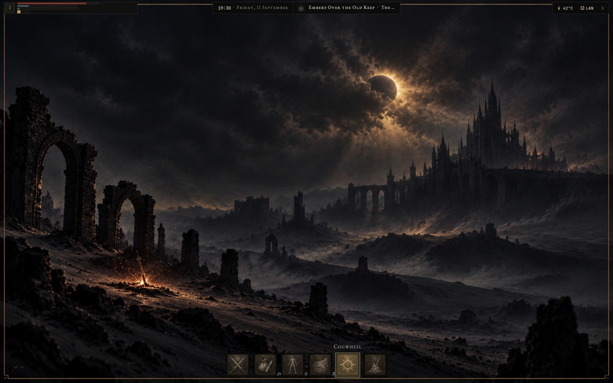
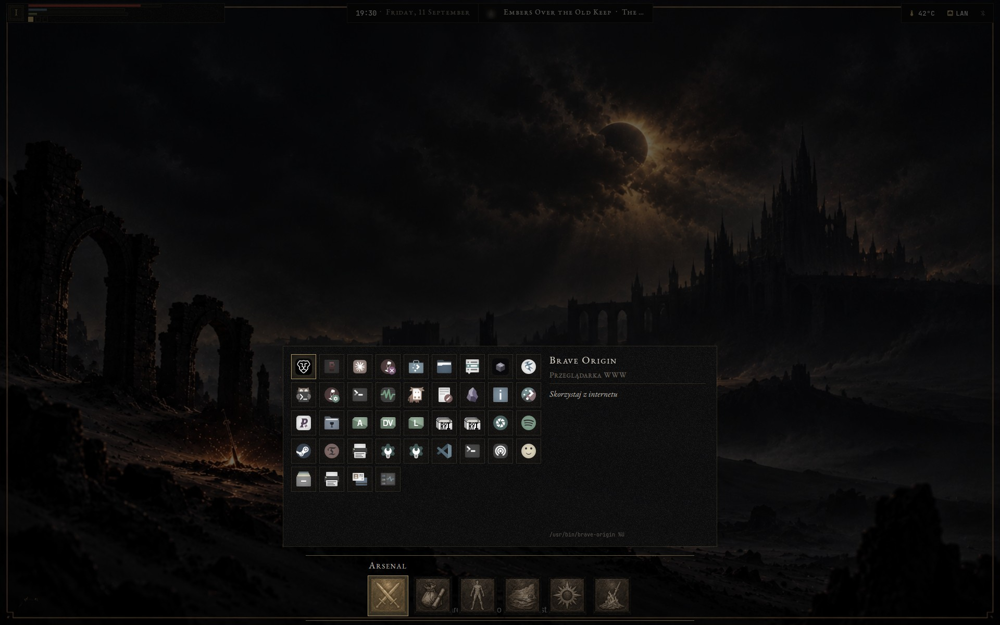
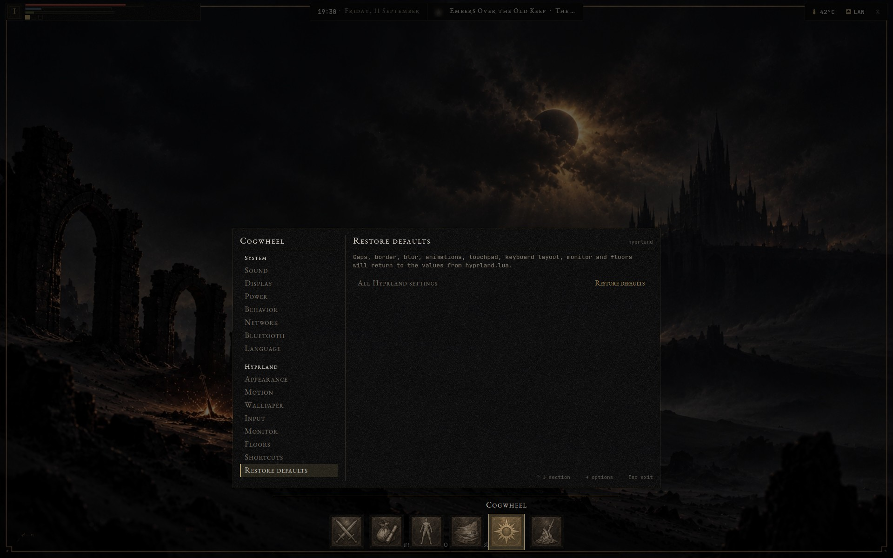
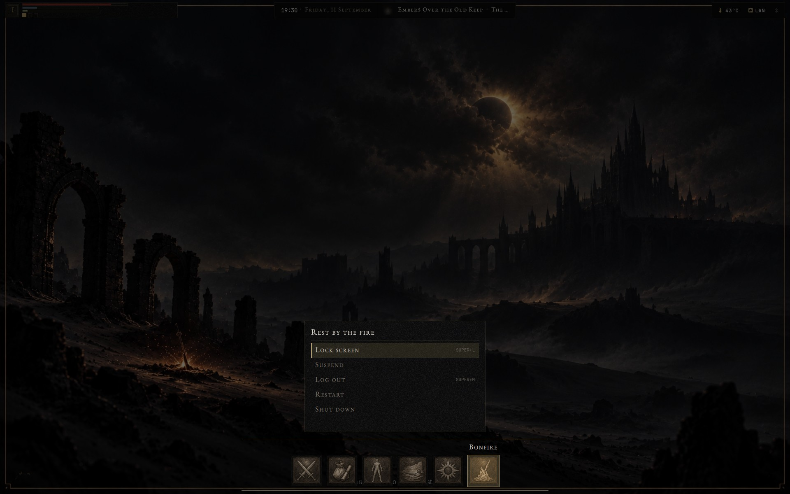
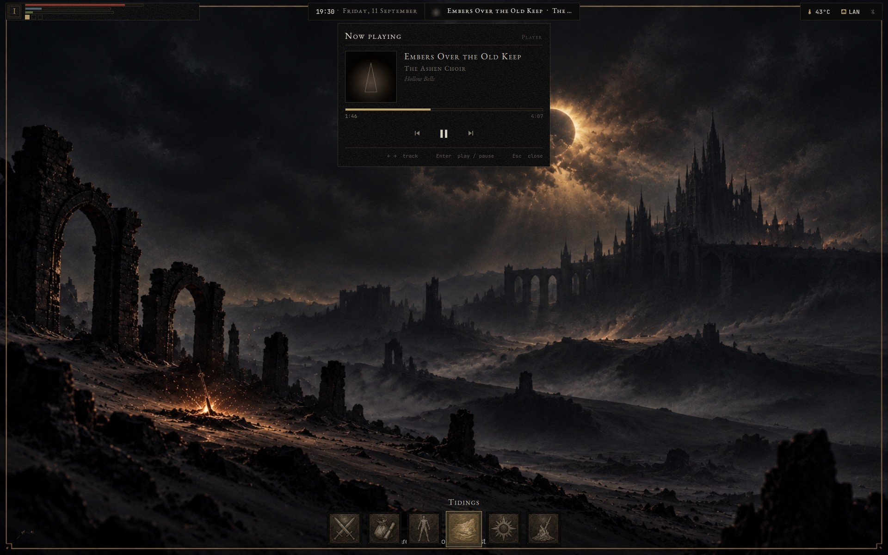
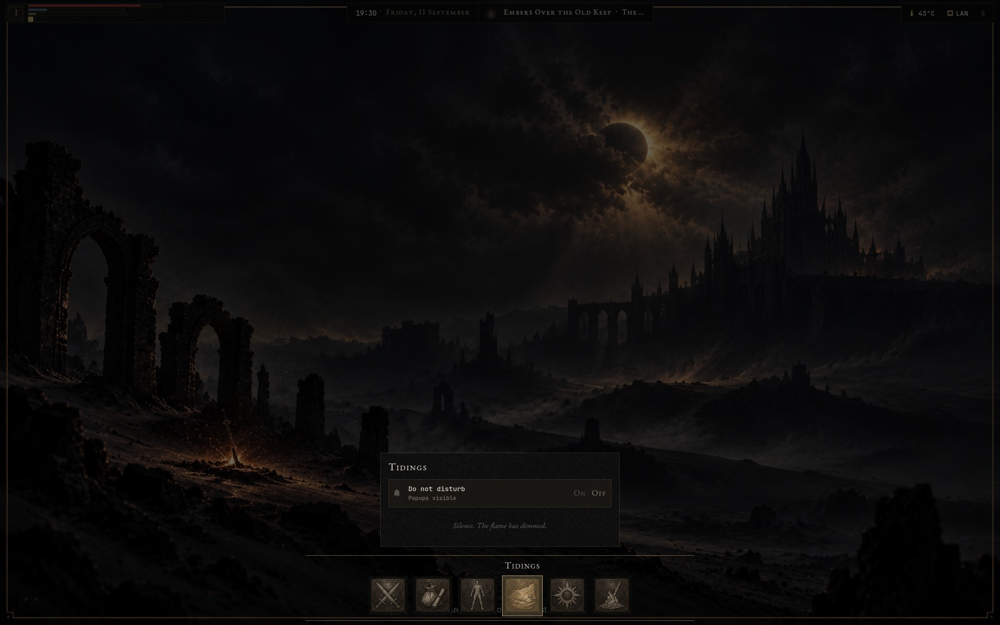

# Hyprland Dark Fantasy

Kompletny pulpit Hyprlanda dla Gentoo Linux, który przypomina menu Dark Souls 3 wyłącznie kształtami, paletą i typografią.

[English](README.md) · **Polski**



| | |
|---|---|
|  |  |
| **Uzbrojenie (Arsenal)**: wszystkie zainstalowane programy z opisem jak przedmiot w grze | **Zębatka (Cogwheel)**: ustawienia w układzie opcji z gry |
|  |  |
| **Ognisko (Bonfire)**: blokada, uśpienie, wylogowanie, restart, wyłączenie | **Panel odtwarzacza**: bieżący odtwarzacz, z paska albo `SUPER + O` |
|  | |
| **Wieści (Tidings)**: historia powiadomień i tryb „nie przeszkadzać” | |

## Co dostajesz

- **Hyprland skonfigurowany w Lua** (`hyprland.lua`, API `hl.*`), a nie w formacie `.conf`, który Hyprland 0.57 usuwa.
- **HUD w lewym górnym rogu**: godło piętra, paski HP / FP / staminy dla baterii, pamięci i procesora, pulpity piętra oraz ostrzeżenia, które pojawiają się tylko przy dużym ruchu w sieci albo wysokiej temperaturze procesora.
- **Rząd sześciu kafli** zamiast doku i menu aplikacji: Uzbrojenie (programy), Sakwa (pliki), Status (btop), Wieści (powiadomienia), Zębatka (ustawienia), Ognisko (sesja). Rząd chowa się, gdy są otwarte okna, i wraca, gdy kursor dotknie dolnej krawędzi.
- **Menu pauzy, które obsłużysz samą klawiaturą**: naciśnij `SUPER + R` i zacznij wpisywać nazwę programu. Strzałki, Enter i Esc działają w każdym kaflu.
- **Piętra**: do dziesięciu pięter pulpitów, każde z własnymi pulpitami 1-0, do tego gesty trzema palcami.
- **Ustawienia na żywo** w Zębatce: dźwięk, jasność, profil zasilania, limit ładowania baterii, sieć, Bluetooth, odstępy, rozmycie, tempo animacji, tapeta, układ klawiatury, skala monitora, piętra.
- **Ramka „teraz” na Waybarze** z zegarem, datą i bieżącym utworem. Strefa odtwarzacza pojawia się tylko wtedy, gdy jakiś program coś odtwarza.
- **Powiadomienia, OSD i panel odtwarzacza obsługuje Quickshell**, bez osobnego demona.
- **Jeden wygląd wszędzie**: hyprlock, motyw logowania SDDM, GTK 3/4, kitty, yazi, btop i picker schowka w rofi.
- **Angielski albo polski**, przełączany natychmiast.
- **Instalatory, które najpierw pokazują plan**: instalator dowiązań z kopiami zapasowymi i instalacja Gentoo od zera.

Design jest autorski. Repozytorium nie zawiera żadnych assetów, grafik, krojów ani tekstów z Dark Souls ani z innej gry.

## Szybki start

Te polecenia dowiązują konfigurację. Pakiety muszą być już zainstalowane (patrz [Wymagania](#wymagania)).

```sh
git clone https://github.com/JamJan05/Hyprland-Dark-Fantasy.git ~/hyprland-dark-fantasy
cd ~/hyprland-dark-fantasy
./install.sh            # próba na sucho: wypisuje, co dowiąże, niczego nie zmienia
./install.sh --apply    # dowiązuje config/ do ~/.config, stare pliki odkłada do kopii
hyprctl reload          # albo wyloguj się i uruchom sesję Hyprlanda
```

Po `--apply` pliki w `~/.config` są dowiązaniami do repozytorium, więc każda zmiana w repo działa od razu. Na koniec instalator wypisuje kroki, które wymagają roota: pliki Portage, motyw SDDM i regułę udev.

> [!NOTE]
> Domyślny układ klawiatury to `pl`. Zmienisz go w Zębatce → Hyprland → Wejście → Układ klawiatury albo w `kb_layout` w `config/hypr/hyprland.lua`.

**Instalujesz Gentoo od zera?** [`bootstrap.sh`](bootstrap.sh) włącza overlaye, instaluje pakiety, klonuje repozytorium i uruchamia `install.sh --apply`. On też najpierw pokazuje plan. Szczegóły w [docs/pl/installation.md](docs/pl/installation.md).

## Wymagania

- **Gentoo Linux** z overlayami **GURU** i **hyproverlay**. Pliki pakietów leżą w `gentoo/`. Konfiguracja powstała na OpenRC + elogind; elementy specyficzne dla Gentoo opisuje [docs/pl/hardware.md](docs/pl/hardware.md).
- **Hyprland 0.56+** z konfiguracją w Lua, **Quickshell** (sprawdzony w wersji 0.3.1), **Waybar** z USE `backlight network wifi mpris tray pipewire pulseaudio upower`.
- hyprlock, hypridle, hyprpaper (składnia 0.8), hyprshot, wl-clipboard + cliphist, rofi-wayland, hyprpolkitagent, xdg-desktop-portal-hyprland.
- PipeWire + WirePlumber, playerctl, brightnessctl, power-profiles-daemon i BlueZ. Sekcja sieci korzysta z NetworkManagera, a odczyt baterii z UPower.
- kitty, yazi, btop, tty-clock, jq, Pillow (`dev-python/pillow`).
- Kroje: **EB Garamond** i **JetBrainsMono Nerd Font** (`media-fonts/nerdfonts` z USE `jetbrainsmono`).
- Wygląd: **adw-gtk3**, ikony **Papirus-Dark**, kursor **Bibata-Original-Classic**.

<details>
<summary>Pełna lista pakietów (ta sama, co w <code>bootstrap.sh</code>)</summary>

```sh
sudo emerge --ask --verbose --changed-use \
  gui-wm/hyprland gui-apps/waybar gui-apps/swaync gui-apps/hyprlock \
  gui-apps/hypridle gui-apps/hyprpaper gui-apps/hyprshot gui-apps/wl-clipboard \
  app-misc/cliphist gui-apps/rofi-wayland sys-auth/hyprpolkitagent \
  gui-libs/xdg-desktop-portal-hyprland media-fonts/nerdfonts media-sound/playerctl \
  media-video/pipewire media-video/wireplumber gui-apps/grim gui-apps/slurp \
  app-misc/jq x11-terms/kitty app-misc/brightnessctl media-sound/cava \
  sys-power/power-profiles-daemon net-wireless/bluez app-misc/yazi app-misc/tty-clock \
  media-fonts/eb-garamond x11-themes/adw-gtk3 x11-themes/papirus-icon-theme \
  x11-themes/bibata-xcursors sys-process/btop dev-python/pillow gui-apps/quickshell
```

Najpierw skopiuj `gentoo/package.accept_keywords/hyprland-desktop` i `gentoo/package.use/hyprland-desktop` do `/etc/portage/`. SDDM nie ma na liście; zainstaluj go sam, jeśli chcesz motyw logowania.

</details>

## Najważniejsze skróty

| Skrót | Działanie |
|---|---|
| `SUPER + R` | Menu kafli, otwarte na Uzbrojeniu (pisz, żeby szukać) |
| `SUPER + U` | Zębatka (ustawienia) |
| `SUPER + O` | Panel odtwarzacza |
| `SUPER + Q` | Terminal (kitty) |
| `SUPER + W` | Menedżer plików (yazi) |
| `SUPER + C` | Zamknij okno |
| `SUPER + V` | Okno pływające / kafelkowane |
| `SUPER + L` | Blokada ekranu |
| `SUPER + SHIFT + V` | Historia schowka |
| `SUPER + SHIFT + S` | Zrzut zaznaczonego obszaru |
| `SUPER + 1..0` | Pulpit na bieżącym piętrze |
| `SUPER + SHIFT + 1..0` | Przenieś okno na pulpit bieżącego piętra |
| `SUPER + CTRL + 1..0` | Zmiana piętra |
| `SUPER + B` | Następny profil zasilania |

Pełna lista jest w [docs/pl/keybindings.md](docs/pl/keybindings.md). Z opisami zobaczysz ją też w Zębatce → Hyprland → Skróty.

## Język

Domyślnie interfejs jest po **angielsku**. Na **polski** przełączysz go w **Zębatce → System → Język**. Zmiana działa od razu, a razem z nią zmieniają się Waybar, ekran blokady i opisy skrótów. Motyw logowania SDDM ma osobne ustawienie języka: `sddm/install-theme.sh --apply --lang pl`. Szczegóły w [docs/pl/cogwheel.md](docs/pl/cogwheel.md#język).

## Dokumentacja

| Strona | Zawartość |
|---|---|
| [Instalacja](docs/pl/installation.md) | `install.sh`, `bootstrap.sh`, motyw SDDM, reguła udev, kopia i przywracanie |
| [Interfejs](docs/pl/interface.md) | Zasady wyglądu, rząd kafli, HUD, pasek, panel odtwarzacza, powiadomienia, blokada |
| [Zębatka](docs/pl/cogwheel.md) | Wszystkie sekcje ustawień, sposób zapisu, język |
| [Piętra](docs/pl/floors.md) | Pulpity pogrupowane w piętra, gesty, mapowanie na workspace'y |
| [Skróty](docs/pl/keybindings.md) | Wszystkie skróty i klawisze w menu |
| [Pułapki](docs/pl/troubleshooting.md) | Problemy wykryte przy budowaniu tej konfiguracji |
| [Sprzęt i przenośność](docs/pl/hardware.md) | Środowisko testowe, elementy zależne od Gentoo i sprzętu |
| [Struktura repozytorium](docs/pl/repository.md) | Mapa katalogów, skrypty pomocnicze, narzędzia |

Wersje angielskie są w [docs/](docs/installation.md).

## Autorzy / licencja

- Wygląd jest inspirowany menu Dark Souls 3. Repozytorium nie zawiera żadnych assetów, grafik, krojów ani tekstów z gry.
- Ikony kafli (`assets/ikony-menu/`) i domyślna tapeta (`assets/wallpaper.png`) są autorstwa właściciela repozytorium.
- Całość stoi na [Hyprlandzie](https://hypr.land), [Quickshellu](https://quickshell.org), [Waybarze](https://github.com/Alexays/Waybar) i pozostałych projektach z listy wymagań.

Licencja: [MIT](LICENSE)
